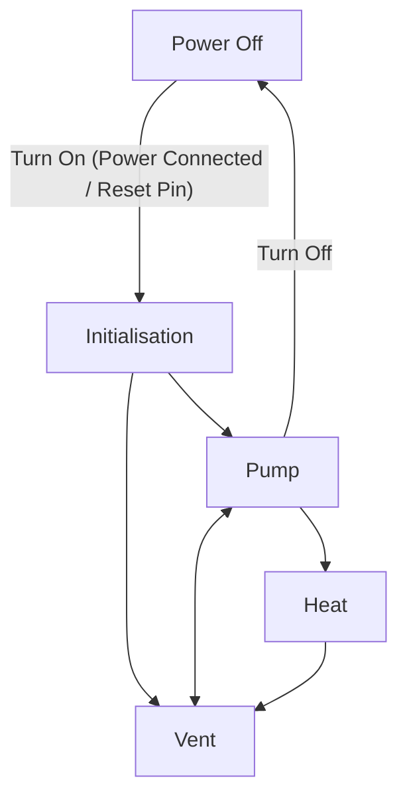

# HENRY-controller

An arduino program to control solenoid valves and vacuum pumps on a microscope sample processing machine. It uses an E-Ink display, temperature sensors, vacuum / pressure sensors, relays and buttons.

When turned on, it presents messages to the user in the top area, and button choices in the lower area. After choosing a function, the arduino controls the physical machinery such as firing relays. Throughout the process, messages are pushed to the screen to indicate the current status. Upon completion, the controller will pick different functions to be available.

The process is:

